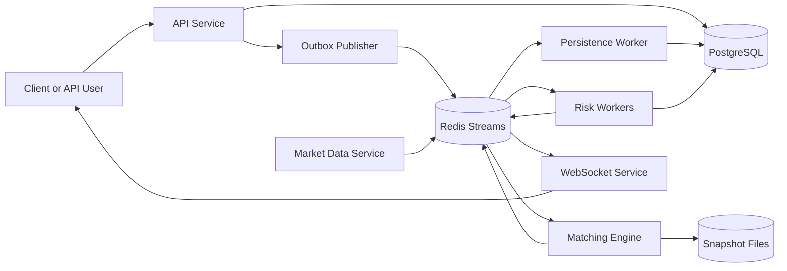
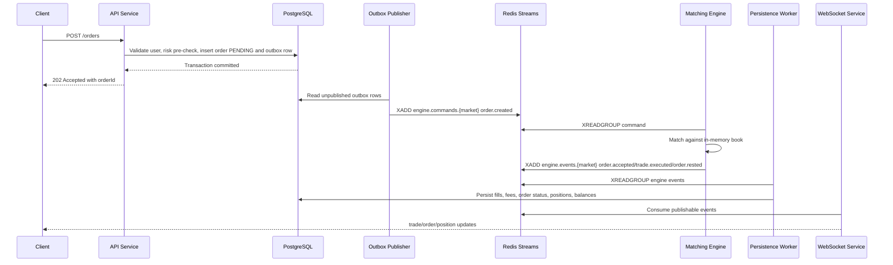
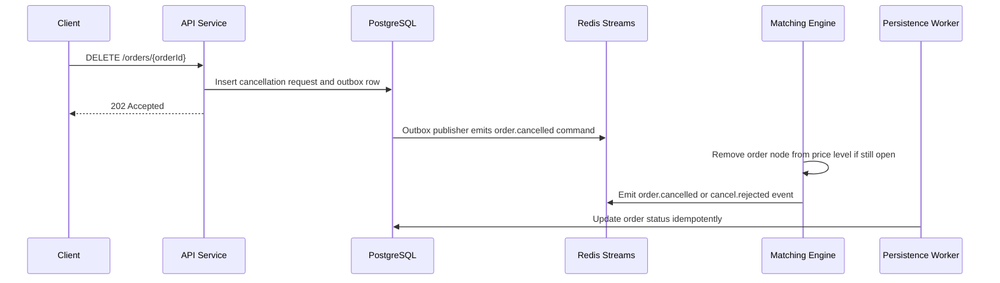
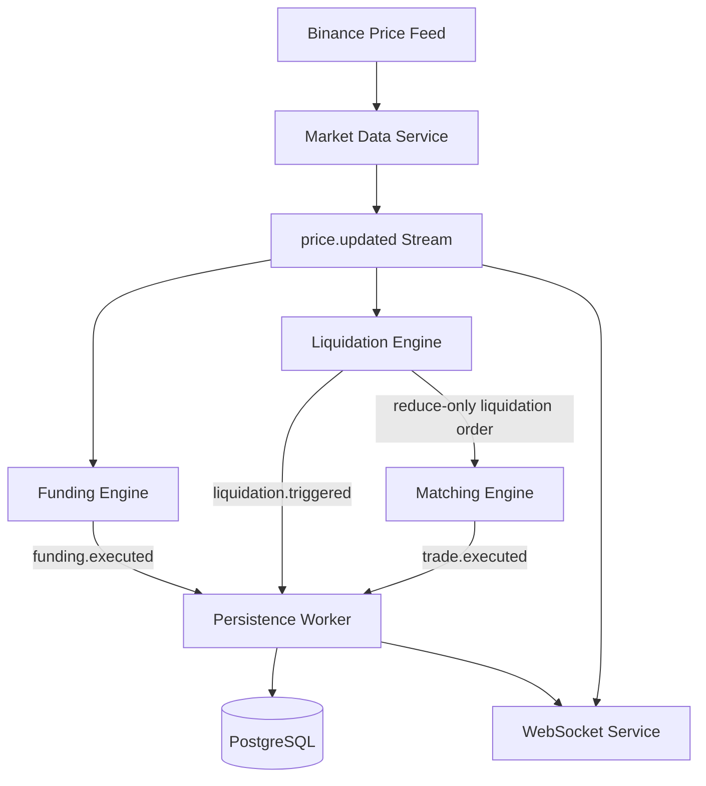

Status: implemented educational backend with local in-memory mode and
production PostgreSQL/Redis/Binance wiring.

This document describes the target backend architecture for a centralized
perpetual futures exchange inspired by Backpack Exchange. It is intentionally
production-style but educational: clear services, explicit data flow, simple
failure recovery, and tests around every important behavior.

The repository keeps the original architecture notes and now includes concrete
runtime adapters for the production path.

## Goals

- Backend-only perpetual futures exchange.
- TypeScript, Bun HTTP server, PostgreSQL, Prisma, Redis Streams, Bun tests,
  and Docker.
- In-memory matching engine with efficient price-time priority.
- PostgreSQL as the durable business source of truth.
- Redis Streams for ordered command and event queues.
- Snapshot plus replay recovery for orderbooks.
- Cross-margin perpetual futures with leverage, funding, liquidations,
  insurance fund, and simplified ADL.
- WebSocket server for real-time public and private updates.
- Reference implementation that a mid-level developer can rebuild from
  scratch.

## Non-Goals

- No frontend.
- No CQRS framework.
- No event sourcing for every business entity.
- No DDD-heavy layering or generic repository pattern.
- No microservice maze. Services are split only where the runtime behavior
  really differs: HTTP API, matching engine, market data, workers, and
  WebSocket fanout.
- No hand-wavy accounting. Balances, fees, fills, PnL, funding, and
  liquidation effects are persisted and testable.

## Existing Workspace Fit

The current repository is a Turborepo workspace with a small
`packages/matching-engine` stub. The implementation should grow from that
shape instead of creating an unrelated layout.

High-level structure:

```text
apps/
  api/                  Bun HTTP API
  market-data/          Binance mark/index price ingestion and funding ticks
  workers/              Persistence, outbox, liquidation, funding workers
packages/
  matching-engine/      In-memory orderbook and matching logic
  risk/                 Margin, PnL, liquidation, ADL calculations
  db/                   Prisma client, schema, seed scripts
  websocket/            WebSocket subscriptions and fanout
  runtime/              Runtime orchestration and Redis stream adapters
prisma/
  schema.prisma
  migrations/
docker/
  postgres/
  redis/
docs/
  ARCHITECTURE.md
  API.md
  WEBSOCKETS.md
  RECOVERY.md
```

The exact package split may be adjusted during implementation if the existing
workspace suggests a smaller path, but the goal is to keep boundaries obvious.

## Design Principles

1. Prefer explicit service functions over framework abstractions.
2. Keep the matching engine deterministic and mostly pure.
3. Use integers for orderbook quantities and prices:
   - `qtyLots` for contract quantity.
   - `priceTicks` for price.
   - Decimal math for margin, PnL, funding, and fees.
4. Process matching commands sequentially per market.
5. Make every side effect idempotent:
   - Unique command IDs.
   - Unique event IDs.
   - Unique fill IDs.
   - Database uniqueness constraints.
6. Treat Redis Streams as queues and replay logs for orderbook recovery, not as
   the permanent accounting database.
7. Keep formulas and exchange-specific choices documented near the code.

## High-Level Topology



## Service Responsibilities

### API Service

Responsibilities:

- Authentication.
- User creation and session or API key management.
- Deposit/onramp simulation.
- Order submission.
- Order cancellation.
- Query balances.
- Query positions.
- Query fills.
- Query order history.
- Query markets.

Important behavior:

- Performs request validation and lightweight risk pre-checks.
- Writes user-facing requests to PostgreSQL.
- Writes outbox rows in the same database transaction.
- Does not mutate in-memory orderbooks directly.
- Does not calculate final fills. The matching engine owns matching.

Why use a simple outbox:

- Without an outbox, a crash between "write order to Postgres" and "publish to
  Redis" can strand an order.
- The outbox is one table plus one worker, not a CQRS framework.
- It keeps Postgres as the source of truth for submitted requests.

### Matching Engine

Responsibilities:

- Keep one in-memory orderbook per market.
- Consume order commands in deterministic order.
- Validate matching-specific rules:
  - Market orders.
  - Limit orders.
  - Partial fills.
  - Post-only.
  - Reduce-only.
  - Self-trade prevention.
- Match by price-time priority.
- Emit ordered engine events.
- Periodically snapshot orderbook state.
- Recover from snapshot plus stream replay.

The matching engine does not:

- Own user authentication.
- Own durable balances.
- Reach into Express request objects.
- Write directly to Prisma models in the matching hot path.

### Persistence Worker

Responsibilities:

- Consume execution events from Redis Streams.
- Persist orders, fills, fees, balances, positions, funding payments,
  liquidations, and insurance fund changes.
- Apply effects idempotently by `eventId` and `fillId`.
- Ack Redis messages only after database writes succeed.

This worker is deliberately boring. It translates events into relational state.

### Market Data Service

Responsibilities:

- Subscribe to Binance mark price and index price updates.
- Normalize external symbols into internal market IDs.
- Publish `price.updated` events.
- Trigger funding interval checks.
- Trigger liquidation checks when mark prices move.

For tests and local development, Binance input will be replaceable with a fake
price publisher.

### Funding Engine

Responsibilities:

- Run every market's funding interval, default 8 hours.
- Calculate premium index:

```text
Premium Index = (Mark Price - Index Price) / Index Price
```

- Calculate funding rate using market config:

```text
Funding Rate = clamp(Premium Index, -fundingRateCap, fundingRateCap)
```

- Apply payments:
  - Positive funding: longs pay shorts.
  - Negative funding: shorts pay longs.
- Persist each user's funding payment.
- Publish `funding.executed`.

The cap is a market configuration value so tests can exercise positive and
negative funding without brittle external assumptions.

### Liquidation Engine

Responsibilities:

- Recalculate account margin after price, fill, funding, or balance changes.
- Trigger liquidation when account equity falls below maintenance margin.
- Publish `liquidation.triggered`.
- Submit reduce-only liquidation orders to close positions.
- Use the insurance fund if the liquidated account cannot cover losses.
- Use simplified ADL if the insurance fund cannot absorb the deficit.

The liquidation engine should be understandable before it is clever. It will
close at available orderbook liquidity first, then settle any residual deficit
through insurance fund or ADL.

### WebSocket Service

Responsibilities:

- Accept public and authenticated private subscriptions.
- Fan out events from Redis Streams.
- Support subscriptions:
  - `trades`
  - `orderbook`
  - `positions`
  - `mark_price`
  - `funding`
- Keep per-connection subscription state.
- Send snapshots on subscribe, then incremental updates.

Private topics require authentication and user scoping.

## Core Data Flow

### Order Submission



Notes:

- API returns after durable submission, not after matching.
- Clients learn final state through queries or WebSocket events.
- Matching remains single-writer per market, avoiding race-heavy locking.

### Order Cancellation



### Market Data, Funding, and Liquidation



## Redis Stream Design

Canonical streams:

```text
engine.commands.{market}
engine.events.{market}
price.updated
position.updated
funding.executed
liquidation.triggered
```

The user-facing event names are stored as the event `type`, for example:

```text
order.created
order.cancelled
trade.executed
price.updated
position.updated
liquidation.triggered
funding.executed
```

Why per-market engine streams:

- Exact replay requires a single total order for orderbook events within a
  market.
- Per-market streams make sharding simple later.
- A busy BTC-PERP book should not block a quiet market.

Consumer groups:

```text
matching-engine:{market}
persistence-worker
websocket-public
market-risk
```

Idempotency:

- Every command includes `commandId`.
- Every emitted event includes `eventId`, `market`, `sequence`, and Redis
  stream ID.
- Persistence tables store processed event IDs.
- Workers can safely retry after crashes.

## Matching Engine Design

### Orderbook State

Per market:

```text
OrderBook
  market
  bids: PriceLevelTree descending
  asks: PriceLevelTree ascending
  ordersById: Map<OrderId, OrderNode>
  sequence: monotonically increasing integer
```

Price level:

```text
PriceLevel
  priceTicks
  totalQtyLots
  head: first OrderNode
  tail: last OrderNode
```

Order node:

```text
OrderNode
  orderId
  userId
  side
  type
  qtyLots
  remainingQtyLots
  priceTicks
  reduceOnly
  postOnly
  createdAt
  prev
  next
```

### Price-Level Structure

The initial implementation should use a small educational balanced tree for
price levels, likely a treap or AVL tree:

- Insert price level: `O(log n)`.
- Remove empty price level: `O(log n)`.
- Get best bid or best ask: `O(log n)` or `O(1)` with a cached best pointer.
- Traverse top levels for orderbook snapshots and WebSocket depth.

Each price level uses a FIFO linked queue:

- Add order at tail: `O(1)`.
- Match from head: `O(1)`.
- Cancel by order ID: `O(1)` after `ordersById` lookup.

This satisfies price-time priority without scanning all prices.

### Matching Rules

Limit buy crosses when:

```text
bestAsk.priceTicks <= limitBuy.priceTicks
```

Limit sell crosses when:

```text
bestBid.priceTicks >= limitSell.priceTicks
```

Market orders cross until:

- requested quantity is filled,
- opposite book is empty, or
- self-trade prevention stops execution.

Post-only:

- If a post-only limit order would immediately cross, reject it before matching.
- If it does not cross, rest it on the book.

Reduce-only:

- Reduce-only orders can only reduce or close an existing position.
- They cannot increase exposure or reverse the position.
- Final enforcement requires position state, so the API/risk layer performs a
  pre-check and the persistence/risk layer revalidates after fills.

Self-trade prevention:

- Default mode: expire taker.
- If the incoming order would match the same user, stop matching that incoming
  order and cancel its remaining quantity.
- This is simple, deterministic, and easy to explain in tests.

### Event Output

Matching emits events such as:

```text
order.accepted
order.rejected
order.rested
order.cancelled
order.cancel_rejected
trade.executed
```

Each `trade.executed` event includes:

```text
tradeId
makerOrderId
takerOrderId
makerUserId
takerUserId
market
priceTicks
qtyLots
makerFee
takerFee
sequence
timestamp
```

Fees are calculated from market config:

```text
makerFee = notional * makerFeeRate
takerFee = notional * takerFeeRate
```

Fee revenue is persisted as ledger entries to the exchange revenue account.

## Persistence Model

Prisma will model the durable business state. Initial tables:

```text
users
api_keys
markets
balances
ledger_entries
orders
fills
positions
funding_payments
liquidations
insurance_funds
processed_events
outbox_events
snapshot_metadata
```

### Users

Stores login identity and status.

Important fields:

```text
id
email
passwordHash
status
createdAt
updatedAt
```

### Markets

Stores market configuration.

Important fields:

```text
id
symbol
baseAsset
quoteAsset
tickSize
lotSize
maxLeverage
initialMarginRate
maintenanceMarginRate
makerFeeRate
takerFeeRate
fundingIntervalHours
fundingRateCap
status
```

### Balances and Ledger Entries

Balances hold current totals by user and asset.

Ledger entries are append-only accounting records for:

- Deposits.
- Trading fees.
- Realized PnL.
- Funding payments.
- Liquidation losses.
- Insurance fund transfers.

This keeps balance updates auditable without making the whole system event
sourced.

### Orders

Orders store request and execution status.

Important fields:

```text
id
clientOrderId
userId
marketId
side
type
timeInForce
price
quantity
remainingQuantity
reduceOnly
postOnly
status
createdAt
updatedAt
```

Statuses:

```text
PENDING
OPEN
PARTIALLY_FILLED
FILLED
CANCELLED
REJECTED
EXPIRED
```

### Fills

Fills are immutable trade executions.

Important fields:

```text
id
tradeId
orderId
userId
marketId
side
liquidityRole
price
quantity
notional
fee
realizedPnl
createdAt
```

### Positions

One net cross-margin position per user per market.

Important fields:

```text
id
userId
marketId
side
quantity
entryPrice
realizedPnl
unrealizedPnl
leverage
liquidationPrice
updatedAt
```

Internally, position quantity can be represented as signed:

- Positive quantity: long.
- Negative quantity: short.
- Zero quantity: closed.

### Funding Payments

Important fields:

```text
id
userId
marketId
positionQuantity
markPrice
indexPrice
fundingRate
paymentAmount
fundingTime
```

### Liquidations

Important fields:

```text
id
userId
marketId
positionQuantity
markPrice
maintenanceMargin
accountEquity
status
insuranceFundUsed
adlUsed
createdAt
```

### Snapshot Metadata

Tracks latest durable snapshot for each market.

Important fields:

```text
id
marketId
snapshotPath
engineSequence
lastRedisStreamId
createdAt
```

## Margin and PnL Model

Initial implementation uses a single cross-margin collateral asset, USDC.

Definitions:

```text
Position Notional = abs(positionQty) * markPrice
Initial Margin = Position Notional / leverage
Maintenance Margin = Position Notional * maintenanceMarginRate
Unrealized PnL Long = (markPrice - entryPrice) * qty
Unrealized PnL Short = (entryPrice - markPrice) * qty
Account Equity = walletBalance + totalUnrealizedPnl
Available Margin = accountEquity - totalInitialMargin - openOrderMargin
```

Sufficient margin check:

```text
availableMargin >= newOrderInitialMargin + estimatedTakerFee
```

Liquidation check:

```text
accountEquity <= totalMaintenanceMargin
```

Position transitions to test:

- Open.
- Increase.
- Reduce.
- Close.
- Reverse.

Reverse is implemented as a close plus open in one fill application path. The
realized PnL applies to the closed quantity, then the remaining quantity starts
a new entry price.

## Liquidation, Insurance Fund, and ADL

Liquidation flow:

1. Detect margin violation.
2. Mark account or position as liquidating to prevent new risk-increasing
   orders.
3. Emit `liquidation.triggered`.
4. Submit a system reduce-only liquidation order.
5. Apply fills normally through the matching and persistence path.
6. If the account has a residual deficit, transfer from insurance fund.
7. If the insurance fund is insufficient, activate ADL.

Insurance fund:

- Funded by configured liquidation fees and optional seed balance.
- Stored by asset, usually USDC.
- Uses ledger entries for every debit and credit.

Simplified ADL:

- Select opposing positions in the same market.
- Rank by profitability and effective leverage:

```text
ADL Score = pnlPercent * effectiveLeverage
```

- Highest ADL score is reduced first.
- Force-reduce opposing position quantity against the remaining bankrupt
  quantity.
- Persist ADL fills and `liquidation` updates.

This is not a full exchange-grade ADL queue, but it is functional and testable.

## Snapshot and Recovery

The orderbook lives in memory, so recovery is required.

### Snapshot Contents

Every N seconds per market, the matching engine writes:

```text
market
engineSequence
lastRedisStreamId
createdAt
bids price levels in FIFO order
asks price levels in FIFO order
open orders by ID
```

Write strategy:

1. Serialize to a temporary file.
2. Flush the file.
3. Atomic rename to final snapshot path.
4. Update `snapshot_metadata` in PostgreSQL.

### Event Replay

Recovery steps:

1. Read latest snapshot metadata for the market.
2. Load the snapshot file.
3. Restore bids, asks, open order map, and engine sequence.
4. Read `engine.events.{market}` from `lastRedisStreamId`.
5. Replay events in Redis stream order.
6. Resume consuming new commands only after replay is complete.

### Why Replay Engine Events, Not API Requests

API requests do not fully describe matching outcomes after partial fills,
self-trade prevention, and cancellations. Engine events are the deterministic
state transitions of the book, so replaying them reconstructs the exact open
book.

### Crash Windows

- If the engine emits events but crashes before snapshot, replay recovers them.
- If the persistence worker crashes after DB write but before Redis ack,
  idempotency prevents duplicate effects.
- If the outbox publisher crashes after publishing but before marking sent,
  command IDs prevent duplicate order processing.

## API Surface

Initial REST endpoints:

```text
POST   /auth/register
POST   /auth/login
GET    /me

GET    /markets
GET    /markets/:marketId

POST   /deposits
GET    /balances
GET    /positions

POST   /orders
DELETE /orders/:orderId
GET    /orders
GET    /orders/:orderId
GET    /fills
```

Order request fields:

```text
marketId
side
type
quantity
price
timeInForce
reduceOnly
postOnly
clientOrderId
```

The API returns durable request status. Execution status arrives through
queries or WebSocket events.

## WebSocket Surface

Endpoint:

```text
GET /ws
```

Subscribe message:

```json
{
  "op": "subscribe",
  "channel": "trades",
  "market": "BTC-PERP"
}
```

Private subscribe message:

```json
{
  "op": "subscribe",
  "channel": "positions",
  "token": "jwt"
}
```

Channels:

```text
trades:{market}
orderbook:{market}
mark_price:{market}
funding:{market}
positions:{userId}
```

Orderbook subscriptions should receive:

1. Snapshot.
2. Incremental updates with sequence numbers.
3. Resync instruction if a sequence gap is detected.

## Configuration

Expected environment variables:

```text
NODE_ENV
PORT
DATABASE_URL
REDIS_URL
JWT_SECRET
PASSWORD_PEPPER
BINANCE_WS_URL
SNAPSHOT_DIR
SNAPSHOT_INTERVAL_MS
FUNDING_INTERVAL_HOURS
DEFAULT_COLLATERAL_ASSET
RUNTIME_MODE
WORKER_ROLE
MARKET_DATA_SYMBOLS
```

Local Docker services:

```text
postgres
redis
api
matching-engine
market-data
websocket
workers
```

## Testing Strategy

Testing is a first-class deliverable. Target coverage: 80 percent or higher.

### Phase 1 Matching Tests

- Exact fill.
- Partial fill.
- Multi-level fill.
- Limit order rests when not crossing.
- Market order expires remaining quantity when liquidity ends.
- Post-only rejection when crossing.
- Reduce-only command shape and validation hooks.
- Self-trade prevention.
- Cancel open order.
- Cancel already filled or unknown order.
- Price-time priority.
- Concurrent order submission is sequenced deterministically.

### Position Tests

- Open.
- Increase.
- Reduce.
- Close.
- Reverse.
- Realized PnL correctness.
- Unrealized PnL correctness.

### Margin Tests

- Sufficient margin.
- Insufficient margin.
- Fee-inclusive margin checks.
- Cross-margin equity across multiple markets.

### Funding Tests

- Positive funding.
- Negative funding.
- Funding cap.
- Funding payments update balances and ledger entries.

### Liquidation Tests

- Normal liquidation through orderbook liquidity.
- Insurance fund usage.
- ADL activation.
- New risk-increasing orders blocked while liquidating.

### Recovery Tests

- Snapshot restore.
- Replay after snapshot.
- Replay with cancellation.
- Replay with partial fills.
- Idempotent duplicate event handling.

### Integration Tests

- API order submission to matching to persistence.
- Deposit then trade.
- WebSocket trade and position updates.
- Worker retry behavior.

## Implementation Phases

Each phase waits for explicit approval before starting.

### Phase 1: Core Matching Engine

Scope:

- In-memory orderbook.
- Efficient price-level data structure.
- Limit and market matching.
- Partial fills.
- Post-only.
- Self-trade prevention.
- Cancel.
- Event output from matching.
- Unit tests.

Out of scope:

- Prisma.
- Redis.
- HTTP API.
- Durable recovery.
- Full margin enforcement.

### Phase 2: Persistence

Scope:

- Prisma schema.
- PostgreSQL Docker setup.
- Migrations and seed data.
- Basic durable models.
- Outbox table.
- Processed event idempotency table.
- Persistence worker skeleton.
- Tests around DB writes and idempotency.

### Phase 3: Positions and Margin

Scope:

- Position update engine.
- Cross-margin calculations.
- Initial and maintenance margin.
- Leverage configuration.
- Balance ledger.
- Risk pre-checks.
- Position and margin tests.

### Phase 4: Funding

Scope:

- Mark/index price model.
- Funding rate calculation.
- 8-hour funding interval.
- Funding payments.
- Positive and negative funding tests.

### Phase 5: Liquidations

Scope:

- Liquidation detection.
- Liquidation order generation.
- Insurance fund.
- Simplified ADL.
- Liquidation tests.

### Phase 6: WebSockets

Scope:

- WebSocket server.
- Public subscriptions.
- Private authenticated subscriptions.
- Orderbook snapshots plus deltas.
- Sequence gap handling.
- WebSocket tests.

### Phase 7: Snapshots and Recovery

Scope:

- Snapshot writer.
- Snapshot loader.
- Redis replay.
- Recovery docs.
- Recovery tests.

Although this architecture documents recovery now, implementation is delayed to
Phase 7 as requested.

### Phase 8: Hardening and Tests

Scope:

- End-to-end flows.
- Docker compose polish.
- API documentation.
- WebSocket documentation.
- Recovery documentation.
- Coverage cleanup.
- Error handling and observability pass.

## Architecture Decisions

### PostgreSQL Is the Business Source of Truth

PostgreSQL stores users, balances, positions, orders, fills, funding payments,
liquidations, and market configuration. Redis is used for ordered transport and
book replay, not for permanent financial records.

### One Matching Writer per Market

Matching is much easier to reason about when each market has exactly one command
consumer applying commands in order. This avoids locks inside the orderbook and
makes tests deterministic.

### Outbox Instead of Direct Publish

The API writes an outbox row in the same transaction as the order request. A
small worker publishes the row to Redis. This prevents lost commands without
introducing a large architecture pattern.

### Explicit Workers Instead of Generic Repositories

Each worker has clear SQL/Prisma operations for its own job. The code should be
easy to debug from an event ID or order ID.

### Net Positions for Perpetuals

The first version uses one net position per user per market. This is simpler
than separate long and short subaccounts and matches many exchange UIs.

### Snapshot Plus Replay for Orderbooks

Open books are in memory for speed and clarity. Snapshots make restart fast;
Redis replay after the snapshot makes restart correct.

## Current Runtime Modes

- Local mode is the default and uses `ExchangeRuntime`, `RuntimeStore`, and
  `InMemoryStreamBus` for fast tests and learning.
- Production mode uses PostgreSQL, JWT auth, outbox rows, Redis Streams,
  production workers, file snapshots, and Binance market data.
